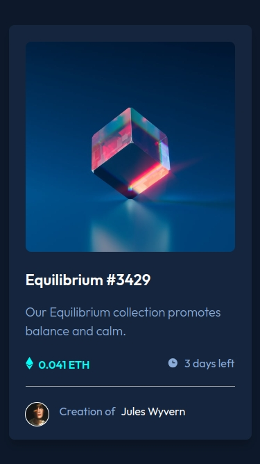
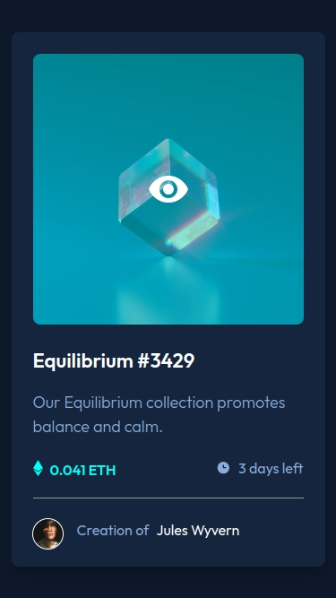
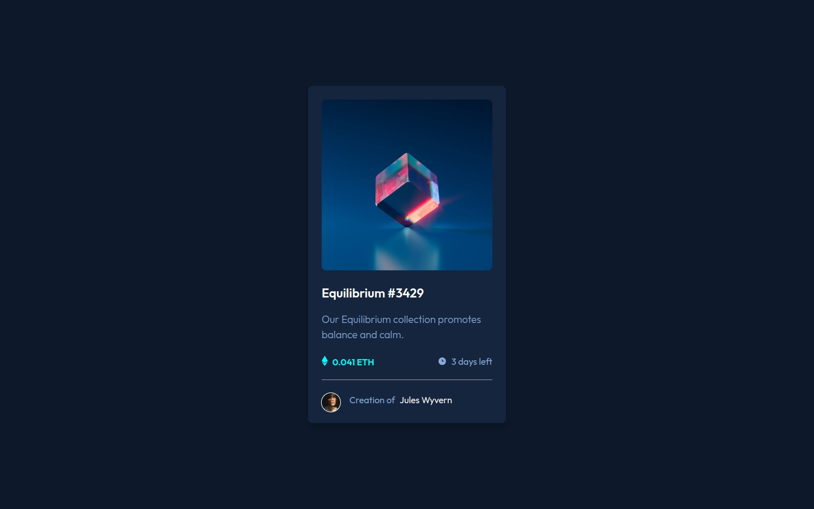
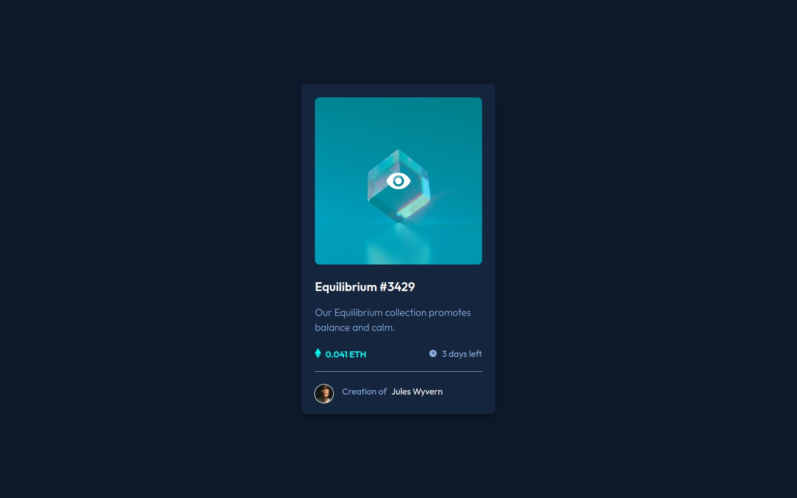

# Frontend Mentor - NFT preview card component solution

This is a solution to the [NFT preview card component challenge on Frontend Mentor](https://www.frontendmentor.io/challenges/nft-preview-card-component-SbdUL_w0U). Frontend Mentor challenges help you improve your coding skills by building realistic projects. 
- Project

Name: nft-preview-card-component

HTML Semantic 
CSS (with transition and overlay effects)
Mobile-first design
Basic accessibility

- Features

Image with hover effect that reveals an overlay with icon.
NFT details (name, description, price, time remaining).
Creator information with circular avatar.
Smooth animations and focus on a clean, modern design.
Fully responsive.

### Screenshot

- Solution URL: [Add solution URL here](https://your-solution-url.com)
- Live Site URL: [Add live site URL here](https://your-live-site-url.com)

## Author

- Frontend Mentor - [@RF1303](https://www.frontendmentor.io/profile/rf1303)
- Linkedin - [Ramiro Fernández](https://www.linkedin.com/in/ramiro-fernandez-260935125/)

